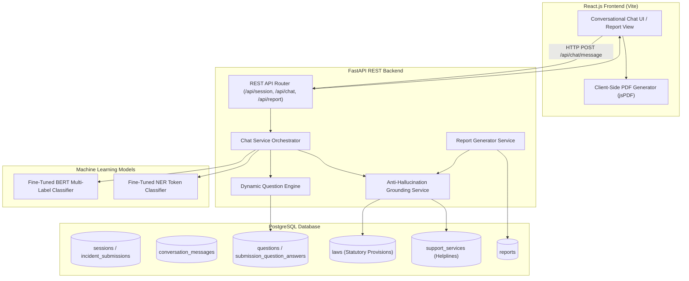

# ABHERA — Adaptive BERT-based Harassment Entity Recognition & Assistance

ABHERA (**Adaptive BERT-based Harassment Entity Recognition & Assistance**) is an India-focused conversational legal-assistance system designed to analyze natural-language descriptions of women's safety-related incidents. The platform combines fine-tuned BERT multi-label incident classification, token-level Named Entity Recognition (NER), a dynamic conditional question engine, and a deterministic database verification layer to generate structured, transparent, non-generative legal assistance reports. Grounded strictly in verified statutory frameworks (Bharatiya Nyaya Sanhita, Indian Penal Code, Protection of Women from Domestic Violence Act, POSH Act, IT Act, and Dowry Prohibition Act) and authoritative support directories, ABHERA guarantees zero legal hallucination while empowering survivors with actionable legal knowledge, support service mappings, and formatted case records.

---

## 1. Project Title & Overview

**ABHERA: Adaptive BERT-based Harassment Entity Recognition & Assistance**

ABHERA is an architectural framework and web-based application built specifically to address the challenge of processing sensitive, unstructured women's safety incident descriptions. Natural-language narratives written by victims or third parties are often emotional, non-technical, incomplete, or fragmented. ABHERA processes these narratives through a multi-stage NLP pipeline:
1. **Multi-Label Incident Classification**: A fine-tuned BERT model identifies one or more applicable harassment categories (Domestic Violence, Sexual Harassment, Stalking, Cyber Harassment, Workplace Harassment, Other Severe Harassment).
2. **Named Entity Recognition (NER)**: Extracts structured key entity mentions such as perpetrator relationships, location/workplace, communication platforms, frequency/duration, evidence, and referenced statutory sections.
3. **Dynamic Question Engine**: Identifies missing contextual information required for comprehensive assessment and generates targeted, non-repetitive follow-up questions.
4. **Anti-Hallucination Legal & Support Grounding**: Queries verified PostgreSQL database tables populated from authoritative statutory records (`laws.csv`) and official helpline registries (`support_services.csv`).
5. **Structured Report & PDF Generation**: Synthesizes a 10-section executive case record rendered dynamically on-screen and downloadable as a client-side PDF document.

---

## 2. Problem Statement

Women encountering harassment, domestic abuse, stalking, or workplace exploitation in India face multiple systemic barriers when seeking legal recourse:
- **Cognitive & Emotional Overwhelm**: Victims describing traumatic experiences struggle to map their experiences to technical statutory provisions or official legal definitions.
- **Multi-Category Incident Complexity**: Real-world incidents frequently span multiple overlapping categories simultaneously (e.g., workplace sexual harassment combined with cyber stalking and intimidation). Standard single-label classification fails to capture this reality.
- **Entity Extraction Deficits**: Key contextual details—such as perpetrator hierarchy, communication channels used, or location types—are buried inside free text and easily overlooked during intake.
- **Risk of Generative Legal Hallucination**: Generative Large Language Models (LLMs) frequently invent non-existent statutory sections, fabricate helpline numbers, or output incorrect legal advice, presenting unacceptable safety and legal risks in real-world applications.
- **Information Incompleteness**: Initial user narratives often omit critical details necessary to determine applicable legal protections or immediate safety resources.

---

## 3. Objectives

- **Automated Incident Classification**: Perform robust multi-label classification over unstructured incident text across 6 primary harassment categories.
- **Contextual Entity Extraction**: Automatically detect entity mentions (perpetrator relationship, venue, platform, evidence, time/frequency) from free-form text.
- **Dynamic Information Retrieval**: Pose targeted follow-up questions only when critical entity fields are missing from the initial narrative.
- **Deterministic Legal & Support Mapping**: Map identified categories strictly to verified legal sections and support helplines stored in PostgreSQL.
- **Anti-Hallucination Guarantee**: Ensure 100% legal and support grounding by enforcing database lookup rules with strict fallback messages for unmapped queries.
- **Transparent Report Generation**: Deliver a structured 10-section case record presenting narrative, classifications, entity extractions, user answers, legal sections, next steps, support services, evidence notes, model provenance, and disclaimers.
- **Client-Side PDF Export**: Provide instant, browser-based generation of a styled two-page executive case record.

---

## 4. Key Features

- **Conversational Chat Interface**: Clean, responsive interface featuring real-time messaging, typing feedback, theme toggling, and interactive dynamic follow-up cards.
- **BERT Multi-Label Classification**: Uses validation-derived optimal decision thresholds to handle multi-category overlap with high precision.
- **Token-Level Named Entity Recognition**: Identifies entities including `PERP_REL`, `LOCATION`, `PLATFORM`, `TIME_FREQ`, `EVIDENCE`, and `LAW_SEC`.
- **Dynamic Question Engine**: Intelligently evaluates extracted entities against a master bank of 10 prioritized questions, avoiding duplicate prompts and persisting answers.
- **PostgreSQL Anti-Hallucination Layer**: Validates predicted labels against PostgreSQL databases (`laws` and `support_services`). Generates explicit fallback notices when records do not match.
- **Location / Platform Fallback Propagation**: Automatically fallback-propagates questionnaire answers into structured location/platform summary cards when NER extractions are absent.
- **Two-Page PDF Generation**: Client-side PDF generation via `jsPDF` using custom brand tokens (`ABHERA_COLORS`), document headers, metadata cards, and verification badges.
- **Model Provenance Tracking**: Discloses model prediction labels, classification confidence, NER entity spans, and database verification status inside every report.

---

## 5. System Architecture

ABHERA operates as a decoupled full-stack architecture combining a React SPA frontend, FastAPI REST backend, fine-tuned PyTorch NLP models, and a PostgreSQL database.



---

## 6. End-to-End Workflow

1. **User Narrative Submission**: The user enters an initial incident description into the React chat interface.
2. **Session & Submission Initialization**: Frontend issues `POST /api/session/start`, establishing a session UUID and corresponding submission record (`SUB-xxxxxxxx`).
3. **Chat Message Processing**: The message is transmitted via `POST /api/chat/message`.
4. **BERT Multi-Label Inference**: The backend executes fine-tuned BERT multi-label classification over the narrative using validation-derived per-label decision thresholds (`DV: 0.65`, `SH: 0.60`, `ST: 0.64`, `CA: 0.72`, `WH: 0.54`, `OV: 0.78`).
5. **NER Entity Extraction**: The NER pipeline scans the text to extract entity mentions across 6 entity classes.
6. **Question Engine Evaluation**: The engine compares extracted entities against required fields. If missing fields are found, a single prioritized question is selected from `questions`.
7. **Conversational Response & Persistence**: The assistant reply, predicted labels, extracted entities, and follow-up question (if any) are persisted in PostgreSQL (`conversation_messages`, `predictions`, `entities`).
8. **Follow-up Q&A Loop**: When the user submits an answer, it is recorded in `submission_question_answers`. The cycle repeats until required details are supplied or questioning completes.
9. **Report Generation Trigger**: The user or system requests final report compilation via `POST /api/report/generate`.
10. **Anti-Hallucination Legal & Support Lookup**: The system queries `laws` and `support_services` using verified positive predicted categories.
11. **Location / Platform Fallback**: If NER extracted neither `LOCATION` nor `PLATFORM`, the service inspects recorded questionnaire answers and populates normalized values (e.g., `"workplace"` $\rightarrow$ `"Workplace"`).
12. **Report Structuring & Database Persistence**: All 10 conceptual sections are assembled into a structured JSON payload and saved in `reports`.
13. **React UI Report Display**: The frontend navigates to `/report/:submissionId`, rendering executive dashboard cards, structured section accordions, and warning banners.
14. **PDF Export**: Clicking "Download PDF" executes client-side `jsPDF` rendering to output a styled 2-page document.

---

## 7. Technology Stack

| Layer | Component / Tool | Version / Spec | Function |
| :--- | :--- | :--- | :--- |
| **Frontend** | React | `^18.2.0` | UI Library (Single Page Application) |
| **Frontend Router**| React Router DOM | `^7.18.3` | SPA Client-Side Routing |
| **Icons** | Lucide React | `^0.344.0` | SVG UI Icons |
| **HTTP Client** | Axios | `^1.20.0` | Backend REST API Communication |
| **PDF Export** | jsPDF | `^4.2.1` | Client-side 2-Page Executive PDF Generation |
| **Build Tool** | Vite | `^5.1.6` | Frontend Development Server & Production Bundler |
| **Backend API** | FastAPI | `>=0.110.0` | High-performance Async Python Web Framework |
| **ASGI Server** | Uvicorn | `>=0.28.0` | Production ASGI HTTP Server |
| **Data Validation**| Pydantic / Pydantic Settings | `>=2.6.0 / >=2.2.0` | Request/Response Schema Enforcement |
| **Database ORM** | SQLAlchemy | `>=2.0.28` | Object-Relational Database Mapping |
| **DB Driver** | psycopg2-binary | `>=2.9.9` | PostgreSQL Database Connector |
| **Database** | PostgreSQL | `>=14.0` | Relational Database Engine |
| **ML Framework** | PyTorch / Hugging Face | Transformer Pipeline | Model Fine-Tuning & Local CPU/GPU Inference |
| **NLP Models** | BERT-base-uncased / NER | Custom Fine-Tuned | Multi-Label Classification & Named Entity Recognition |
| **Testing** | Python `unittest` / `pytest` | Standard Library / Pytest | Backend API & Service Test Suite |

---

## 8. Frontend Architecture

The React single-page application is structured cleanly inside `frontend/src`:

```text
frontend/src/
├── components/
│   ├── AbheraEmblem.jsx       # Custom SVG emblem & branding
│   ├── ChatInput.jsx          # Message submission input bar
│   ├── ChatMessage.jsx        # Conversational message bubble renderer
│   ├── Navbar.jsx             # Top navigation header
│   ├── QuestionnaireModal.jsx # Dynamic question modal dialog
│   └── ThemeToggle.jsx        # Dark/light mode theme toggle button
├── context/
│   └── ConversationContext.jsx# React Context for session & state management
├── pages/
│   ├── Home.jsx               # Landing page with incident entry portal
│   ├── Chatbot.jsx            # Interactive chat room page
│   ├── Processing.jsx         # Report generation loading/status view
│   └── Report.jsx             # Comprehensive 10-section report & PDF generator
├── services/
│   └── api.js                 # Axios API service endpoints
├── styles/                    # Modular CSS stylesheets
├── App.jsx                    # Root Router & Layout container
└── main.jsx                   # Application entry point
```

### Key Frontend Views
- **Home Page (`Home.jsx`)**: Landing interface allowing users to launch a new session, select state/district context, or enter an initial narrative.
- **Chatbot Page (`Chatbot.jsx`)**: Full conversational interface supporting narrative entry, real-time message streaming, assistant responses, and inline follow-up cards.
- **Processing Page (`Processing.jsx`)**: Intermediate loading view that polls backend report readiness during final assembly.
- **Report View (`Report.jsx`)**: Executive report viewer displaying the "Situation at a Glance" dashboard grid, 10 detailed section cards, database verification badges, model provenance, and triggering `jsPDF` for PDF generation.

---

## 9. Backend Architecture

The FastAPI backend is structured cleanly inside `backend/app`:

```text
backend/app/
├── api/                   # API package initialization
├── config.py              # Application settings & environment variables
├── core/                  # Core application setup
├── database.py            # PostgreSQL SQLAlchemy engine & session maker
├── db/                    # Ingestion scripts & database migrations
│   ├── init_db.py         # Database initialization
│   └── seed_questions.py  # Master question bank seeding script
├── main.py                # FastAPI application instance & CORS middleware
├── ml/                    # Machine learning models & inference wrappers
├── models/                # SQLAlchemy ORM Data Models
│   ├── conversation_message.py
│   ├── entity.py
│   ├── incident_submission.py
│   ├── law.py
│   ├── prediction.py
│   ├── question.py
│   ├── report.py
│   ├── session.py
│   ├── support_service.py
│   └── user.py
├── question_engine/       # Dynamic question engine
│   ├── dynamic_generator.py
│   ├── engine.py          # Main engine orchestrator
│   ├── question_selector.py
│   └── rules.py           # Field checking rules
├── routes/                # FastAPI REST Route Handlers
│   ├── chat.py            # POST /api/chat/message
│   ├── health.py          # GET /health
│   ├── report.py          # POST /api/report/generate, GET /api/report/{submission_id}
│   └── session.py         # POST /api/session/start, GET /api/session/{session_id}
├── schemas/               # Pydantic Request/Response Data Validation Schemas
│   ├── chat.py
│   ├── report.py
│   └── session.py
├── services/              # Core Business Logic & Orchestration
│   ├── anti_hallucination.py  # Grounding verification layer
│   ├── chat_service.py        # Conversational flow pipeline
│   ├── data_importer.py       # Data CSV ingestion service
│   ├── legal_mapping.py       # Legal section mapper
│   ├── report_generator.py    # 10-section report builder
│   ├── session_service.py     # Session manager
│   └── support_mapping.py     # Support helpline mapper
└── utils/                 # General utility modules
```

---

## 10. BERT Multi-Label Classification

ABHERA fine-tunes `bert-base-uncased` for multi-label classification across 6 harassment categories:
- **`DV`**: Domestic Violence (cruelty by husband/relatives, physical abuse, marital harassment)
- **`SH`**: Sexual Harassment (outraging modesty, unwelcome physical/verbal sexual contact)
- **`ST`**: Stalking (repeated unwanted following, physical/electronic surveillance, persistent contact)
- **`CA`**: Cyber Harassment / Abuse (online harassment, unauthorized image sharing, fake profiles, cyber bullying)
- **`WH`**: Workplace Harassment (harassment at work, POSH violations, supervisor exploitation)
- **`OV`**: Other Severe Harassment / Violent Threats (grave assault, kidnapping threats, severe intimidation)

### Experimental Protocol & Dataset Splits
- **Training Split**: 760 incidents (`ml/preprocessing/train_data.csv`)
- **Validation Split**: 162 incidents (`ml/preprocessing/val_data.csv`)
- **Held-Out Test Split**: 164 incidents (`ml/preprocessing/test_data.csv`)

### Validation-Derived Optimal Thresholding
Rather than applying an arbitrary uniform decision threshold (e.g., 0.50), ABHERA tunes individual classification thresholds strictly on the validation set to maximize per-label F1 scores:

| Category Code | Harassment Category Description | Optimal Validation Decision Threshold |
| :--- | :--- | :---: |
| **`DV`** | Domestic Violence | `0.65` |
| **`SH`** | Sexual Harassment | `0.60` |
| **`ST`** | Stalking | `0.64` |
| **`CA`** | Cyber Harassment | `0.72` |
| **`WH`** | Workplace Harassment | `0.54` |
| **`OV`** | Other Severe Harassment | `0.78` |

### Held-Out Test Set Performance Benchmark
Evaluated on the unexposed 164-sample test split, the fine-tuned BERT model achieves:

| Evaluation Metric | Achieved Value | Notes / Description |
| :--- | :---: | :--- |
| **Exact Match / Subset Accuracy** | **`83.54%`** | 137 out of 164 cases matched all binary label predictions exactly |
| **Elementwise Binary Accuracy** | **`96.95%`** | Mean accuracy across all $164 \times 6 = 984$ individual binary decisions |
| **Micro Precision** | **`95.76%`** | Aggregated true positive over total positive predictions |
| **Micro Recall** | **`87.29%`** | Aggregated true positive over ground truth positive labels |
| **Micro F1 Score** | **`91.33%`** | Primary global classification metric |
| **Macro Precision** | **`95.82%`** | Unweighted mean of category precisions |
| **Macro Recall** | **`86.45%`** | Unweighted mean of category recalls |
| **Macro F1 Score** | **`90.37%`** | Unweighted mean of category F1 scores |
| **Partial Match Success Rate** | **`94.51%`** | 155 out of 164 cases correctly identified at least one true positive label |

---

## 11. Named Entity Recognition (NER) Model

The token-level NER model extracts structured entities directly from incident text to minimize user manual data entry.

### Supported Entity Types
1. `PERP_REL`: Perpetrator relationship (e.g., "husband", "ex-boyfriend", "supervisor", "colleague", "stranger")
2. `LOCATION`: Physical venue or location (e.g., "office building", "home", "college campus", "public bus")
3. `PLATFORM`: Communication platform/channel (e.g., "WhatsApp", "Instagram", "email", "phone calls")
4. `TIME_FREQ`: Incident frequency/duration (e.g., "daily for 3 months", "last night", "every evening")
5. `EVIDENCE`: Mentioned evidence types (e.g., "screenshots", "call recordings", "CCTV footage")
6. `LAW_SEC`: Specific statutory sections mentioned by user (e.g., "Section 498A", "POSH Act")

### Held-Out NER Evaluation Benchmark
Evaluated on a human-annotated held-out test dataset of 60 unexposed gold records containing 66 ground-truth entity spans:

| NER Benchmark Metric | Achieved Metric | Details |
| :--- | :---: | :--- |
| **Gold Test Records** | `60` | Unexposed human-annotated test incidents |
| **Gold Entity Spans** | `66` | Total ground-truth entity mentions |
| **Entity Micro Precision** | **`100.00%`** | Zero false positive entity extractions |
| **Entity Micro Recall** | **`98.48%`** | 65 of 66 entity spans correctly extracted |
| **Entity Micro F1 Score** | **`99.24%`** | Primary entity extraction benchmark |
| **Active Class Macro F1** | **`99.00%`** | Mean F1 across `PERP_REL`, `LOCATION`, `TIME_FREQ`, `PLATFORM` |

---

## 12. Knowledge Base & Datasets

ABHERA incorporates three primary datasets stored in `data/`:

### 1. `womens_safety_dataset.csv`
- **Total Records**: 1,087 incident narratives.
- **Columns**: `id`, `narrative_text`, `DV`, `SH`, `ST`, `CA`, `WH`, `OV`, `ipc_bns_section`, `evidence_notes`, `source`.
- **Purpose**: Fine-tuning BERT multi-label classifier and training/evaluating NER pipeline.

### 2. `laws.csv` (Statutory Provisions Database)
- **Total Records**: 34 authoritative Indian statutory provisions.
- **Columns**: `act_name`, `section_number`, `section_text`, `applicable_label`.
- **Statutory Acts Included**:
  - Bharatiya Nyaya Sanhita (BNS, 2023)
  - Indian Penal Code (IPC, 1860)
  - Protection of Women from Domestic Violence Act (DV Act, 2005)
  - Sexual Harassment of Women at Workplace Act (POSH Act, 2013)
  - Information Technology Act (IT Act, 2000)
  - Dowry Prohibition Act (1961)

### 3. `support_services.csv` (Verified Support Directory)
- **Total Records**: 14 verified national and state support services.
- **Columns**: `service_type`, `name`, `contact_number`, `state`, `district`, `applicable_label`.
- **Key Resources**:
  - National Emergency Response Support System (`112`)
  - NCW 24x7 Helpline (`14490`)
  - Women Helpline Sambal (`181`)
  - Anti-Obscene Calls Helpline (`1091`)
  - National Cyber Crime Helpline (`1930`)
  - SHe-Box Portal (`https://shebox.wcd.gov.in`)
  - National Cyber Crime Reporting Portal (`https://www.cybercrime.gov.in`)

---

## 13. Dynamic Question Engine

When an initial narrative omits key details, the Dynamic Question Engine identifies missing entity fields and prompts the user with targeted follow-up questions.

### Engine Operations
1. **Field Checking**: Inspects `extracted_entities` for required fields (`PERP_REL`, `LOCATION`, `PLATFORM`, `TIME_FREQ`, `EVIDENCE`).
2. **Priority Selection**: Queries the master `questions` table for active questions matching missing entity types, sorted by priority.
3. **Duplicate Prevention**: Filters against `submission_question_answers` to ensure no question is presented twice during a session.
4. **Q&A Persistence**: User answers are recorded with timestamps in PostgreSQL and rendered in Section 04 of the final report.

---

## 14. Legal Information Mapping

Legal provisions are retrieved through a deterministic mapping service (`app/services/legal_mapping.py`):
1. Takes positive predicted labels from BERT classification (e.g., `["DV", "SH"]`).
2. Queries the PostgreSQL `laws` table for rows where `applicable_label` matches predicted categories.
3. Groups provisions by statutory act (`act_name`) and section number.
4. Eliminates duplicate statutory references.
5. If no categories are predicted or no database matches are returned, emits the exact fallback response:
   > *"Information not available in the provided knowledge base."*

---

## 15. Support Service Mapping

Support service mapping (`app/services/support_mapping.py`) retrieves official helplines and portals:
1. Queries the `support_services` table using predicted incident labels.
2. Filters by user state and district if provided.
3. Includes national helplines (`ERSS 112`, `NCW 14490`, `Sambal 181`) as universal primary emergency resources.
4. If no support service matches the query criteria, emits the exact fallback response:
   > *"No matching support service was found in the available support-services database."*

---

## 16. Anti-Hallucination Design

Generative AI models risk hallucinating legal advice, creating invalid legal section numbers, or outputting non-existent helpline numbers. ABHERA implements a strict anti-hallucination architecture:

```text
User Text Input
      │
      ▼
BERT / NER Inference (ML Prediction & Entity Extraction Only)
      │
      ▼
Anti-Hallucination Verification Layer (app/services/anti_hallucination.py)
      │
      ▼
PostgreSQL Database Lookup (laws & support_services tables ONLY)
      │
      ├── Match Found  ──► Return Verified Database Records
      └── No Match     ──► Return Verbatim Grounded Fallback Message
```

### Empirical Safety Audit Verification
- **Legal Grounding Success Rate**: `100.00%` (All returned provisions originate verbatim from PostgreSQL `laws`).
- **Anti-Hallucination Pass Rate**: `100.00%` (Zero hallucinated legal sections or phone numbers produced).
- **Negative Test Verification**: `100.00%` (Invalid/unmapped categories return exact fallback text).

---

## 17. Database Schema Architecture

PostgreSQL manages session lifecycle, message logs, predictions, entities, questions, legal records, support services, and generated reports across 10 tables:

```sql
-- Core Session Management
CREATE TABLE sessions (
    session_id VARCHAR(64) PRIMARY KEY,
    user_id VARCHAR(64),
    created_at TIMESTAMP WITH TIME ZONE DEFAULT CURRENT_TIMESTAMP,
    updated_at TIMESTAMP WITH TIME ZONE DEFAULT CURRENT_TIMESTAMP
);

-- Incident Submissions
CREATE TABLE incident_submissions (
    id SERIAL PRIMARY KEY,
    submission_id VARCHAR(64) UNIQUE NOT NULL,
    session_id VARCHAR(64) REFERENCES sessions(session_id) ON DELETE CASCADE,
    narrative_text TEXT NOT NULL,
    state VARCHAR(100),
    district VARCHAR(100),
    predicted_labels JSON,
    extracted_entities JSON,
    report_generated BOOLEAN DEFAULT FALSE,
    timestamp TIMESTAMP WITH TIME ZONE DEFAULT CURRENT_TIMESTAMP
);

-- Master Legal Database
CREATE TABLE laws (
    id SERIAL PRIMARY KEY,
    act_name VARCHAR(100) NOT NULL,
    section_number VARCHAR(50) NOT NULL,
    section_text TEXT NOT NULL,
    applicable_label VARCHAR(20) NOT NULL
);

-- Master Support Services Database
CREATE TABLE support_services (
    id SERIAL PRIMARY KEY,
    service_type VARCHAR(50) NOT NULL,
    name VARCHAR(255) NOT NULL,
    contact_number VARCHAR(255) NOT NULL,
    state VARCHAR(100) NOT NULL,
    district VARCHAR(100) NOT NULL,
    applicable_label VARCHAR(100) NOT NULL
);

-- Question Engine Master Bank
CREATE TABLE questions (
    question_id VARCHAR(64) PRIMARY KEY,
    category VARCHAR(100) NOT NULL,
    question_text TEXT NOT NULL,
    required_entity VARCHAR(100) NOT NULL,
    priority INT DEFAULT 1,
    active BOOLEAN DEFAULT TRUE
);

-- Question Answers Tracking
CREATE TABLE submission_question_answers (
    id SERIAL PRIMARY KEY,
    submission_id VARCHAR(64) REFERENCES incident_submissions(submission_id) ON DELETE CASCADE,
    question_id VARCHAR(64) REFERENCES questions(question_id) ON DELETE CASCADE,
    answer TEXT,
    asked_at TIMESTAMP WITH TIME ZONE DEFAULT CURRENT_TIMESTAMP,
    answered_at TIMESTAMP WITH TIME ZONE
);

-- Reports Storage
CREATE TABLE reports (
    id SERIAL PRIMARY KEY,
    submission_id VARCHAR(64) UNIQUE REFERENCES incident_submissions(submission_id) ON DELETE CASCADE,
    report_data JSONB NOT NULL,
    created_at TIMESTAMP WITH TIME ZONE DEFAULT CURRENT_TIMESTAMP
);
```

---

## 18. Structured Report Generation

The report generator (`app/services/report_generator.py`) builds a structured 10-section JSON report:

1. **Incident Summary**: Contains original initial narrative description.
2. **Identified Incident Type**: Lists positive BERT classified harassment categories.
3. **Extracted Information**: Displays NER extracted entities (`PERP_REL`, `LOCATION`, `PLATFORM`, `TIME_FREQ`, `EVIDENCE`).
4. **User-Provided Details**: Formats exact follow-up questions together with corresponding user answers.
5. **Relevant Legal Information**: Verified statutory provisions retrieved from PostgreSQL.
6. **Suggested Next Steps**: Actionable guidance (evidence preservation, written documentation).
7. **Available Support Services**: Helplines and online portals from verified database records.
8. **Evidence / Information Notes**: Synthesized notes on evidence mentions.
9. **Model Prediction Information**: Transparency block detailing BERT confidence scores and NER entities.
10. **Disclaimer**: Legal disclaimer stating that output is informational and not professional legal advice.

---

## 19. Client-Side PDF Report Generation

`Report.jsx` incorporates client-side PDF document generation using `jsPDF`:
- **Visual Parity**: Uses design tokens matching the React web interface (`#1E4F8A` primary navy, `#F7F5F0` background, `#B89A5A` gold accent).
- **Two-Page Executive Layout**:
  - **Page 1**: Document header, metadata grid (Submission ID, Date, Database Verified badge), and "Situation at a Glance" 2x2 summary card grid.
  - **Page 2**: Legal provisions table, support service directory, model prediction provenance, and legal disclaimers.

---

## 20. API Documentation

| Method | Endpoint | Summary | Request Payload | Response Model |
| :--- | :--- | :--- | :--- | :--- |
| **`GET`** | `/health` | Health Check | None | `{"status": "online", "service": "FastAPI Backend"}` |
| **`POST`**| `/api/session/start` | Start Session | `SessionStartRequest` | `SessionResponse` |
| **`GET`** | `/api/session/{session_id}` | Get Session | None | `SessionResponse` |
| **`POST`**| `/api/chat/message` | Process Chat Message | `ChatMessageRequest` | `ChatMessageResponse` |
| **`POST`**| `/api/report/generate` | Generate Report | `ReportGenerateRequest` | `ReportResponse` |
| **`GET`** | `/api/report/{submission_id}`| Get Report | None | `ReportResponse` |

---

## 21. Directory Structure

```text
Abhera(Mini)/
├── backend/
│   ├── app/
│   │   ├── api/
│   │   ├── config.py
│   │   ├── database.py
│   │   ├── db/
│   │   ├── main.py
│   │   ├── ml/
│   │   ├── models/
│   │   ├── question_engine/
│   │   ├── routes/
│   │   ├── schemas/
│   │   ├── services/
│   │   └── utils/
│   ├── tests/
│   ├── .env.example
│   └── requirements.txt
├── data/
│   ├── laws.csv
│   ├── support_services.csv
│   └── womens_safety_dataset.csv
├── docs/
│   ├── anti_hallucination.md
│   ├── architecture.md
│   └── database_schema.md
├── frontend/
│   ├── src/
│   │   ├── components/
│   │   ├── context/
│   │   ├── pages/
│   │   ├── services/
│   │   └── styles/
│   ├── package.json
│   └── vite.config.js
├── ml/
│   ├── evaluation/
│   ├── preprocessing/
│   └── training/
├── models/
│   ├── bert_multilabel/
│   └── ner/
├── README.md
└── requirements.txt
```

---

## 22. Installation & Setup (Windows)

### Prerequisites
- Windows 10 / 11
- Python 3.10+
- Node.js v18+ & npm
- PostgreSQL 14+
- Git

### Step-by-Step Installation

1. **Clone the Repository**:
   ```powershell
   git clone https://github.com/GundaSaiDeepthi/Abhera.git
   cd Abhera(Mini)
   ```

2. **Configure Python Virtual Environment**:
   ```powershell
   cd backend
   python -m venv venv
   .\venv\Scripts\Activate.ps1
   pip install --upgrade pip
   pip install -r requirements.txt
   ```

3. **Configure Environment Variables**:
   Copy `.env.example` to `.env` inside `backend/`:
   ```powershell
   copy .env.example .env
   ```
   Update `.env` with your local PostgreSQL credentials:
   ```env
   POSTGRES_USER=postgres
   POSTGRES_PASSWORD=your_postgres_password
   POSTGRES_HOST=localhost
   POSTGRES_PORT=5432
   POSTGRES_DB=womens_safety_db
   ```

4. **Initialize PostgreSQL Database**:
   Create database in PostgreSQL:
   ```sql
   CREATE DATABASE womens_safety_db;
   ```
   Run database table creation & seeding scripts:
   ```powershell
   python -m app.db.init_db
   python -m app.db.seed_questions
   python -m app.services.data_importer
   ```

5. **Install Frontend Dependencies**:
   Open a new terminal:
   ```powershell
   cd D:\Abhera(Mini)\frontend
   npm install
   ```

---

## 23. Environment Variables

| Variable Name | Default Value | Description |
| :--- | :--- | :--- |
| `POSTGRES_USER` | `postgres` | PostgreSQL Database Username |
| `POSTGRES_PASSWORD` | `postgres` | PostgreSQL Database Password |
| `POSTGRES_HOST` | `localhost` | PostgreSQL Host Server |
| `POSTGRES_PORT` | `5432` | PostgreSQL Server Port |
| `POSTGRES_DB` | `womens_safety_db` | Target PostgreSQL Database Name |
| `DATABASE_URL` | Optional | Direct Connection URI Override |

---

## 24. Running the Application

### Start Backend API Server
```powershell
cd D:\Abhera(Mini)\backend
.\venv\Scripts\Activate.ps1
uvicorn app.main:app --reload --port 8000
```
- API Root: `http://localhost:8000/`
- Interactive OpenAPI Swagger Docs: `http://localhost:8000/docs`

### Start Frontend Vite Dev Server
```powershell
cd D:\Abhera(Mini)\frontend
npm run dev
```
- Application Web UI: `http://localhost:5173/`

---

## 25. Software Testing & Verification

ABHERA includes an automated backend test suite built with Python `unittest`.

### Execute Backend Test Suite
```powershell
cd D:\Abhera(Mini)\backend
.\venv\Scripts\python.exe -m unittest discover tests
```

### Key Test Coverage
- `test_chat_api.py`: End-to-end chat message pipeline execution.
- `test_report_generator.py`: 22 unit tests verifying 10-section report assembly, default next steps, fallback propagation, and data normalization.
- `test_hallucination.py`: Anti-hallucination verification tests verifying 100% database grounding and fallback notice emissions.
- `test_legal_mapping.py` & `test_support_mapping.py`: Mapping logic tests against laws and support services tables.

---

## 26. Comprehensive Model Evaluation & Baseline Comparison

### 1. BERT Threshold Tuning vs. Uniform Threshold
Comparing uniform 0.50 decision thresholds against validation-derived per-label optimal thresholds:

| Metric | Uniform 0.50 Threshold | Validation-Derived Optimal Thresholds | Absolute Gain |
| :--- | :---: | :---: | :---: |
| **Exact Match Accuracy** | `15.24%` | **`83.54%`** | **`+68.29 pp`** |
| **Elementwise Accuracy** | `77.64%` | **`96.95%`** | **`+19.31 pp`** |
| **Micro Precision** | `45.09%` | **`95.76%`** | **`+50.67 pp`** |
| **Micro F1 Score** | `61.94%` | **`91.33%`** | **`+29.39 pp`** |
| **Macro F1 Score** | `61.03%` | **`90.37%`** | **`+29.33 pp`** |

### 2. Traditional Baseline Comparison (Task 6)
To evaluate model performance rigorously, traditional machine learning baselines (TF-IDF + Logistic Regression and TF-IDF + Linear SVM) were evaluated under identical 760/162/164 train/val/test splits:

| Model Architecture | Feature Representation | Exact Match | Elementwise Acc | Micro P | Micro R | Micro F1 | Macro F1 |
| :--- | :--- | :---: | :---: | :---: | :---: | :---: | :---: |
| **Fine-Tuned BERT** | Contextual Embeddings | `83.54%` | `96.95%` | `0.9576` | `0.8729` | `0.9133` | `0.9037` |
| **TF-IDF + Logistic Regression** | TF-IDF (1,2 n-grams) | **`95.73%`** | **`99.19%`** | `0.9779` | `0.9779` | **`0.9779`** | `0.9705` |
| **TF-IDF + Linear SVM** | TF-IDF (1,2 n-grams) | `96.34%` | `98.98%` | `0.9622` | `0.9834` | `0.9727` | **`0.9719`** |

### 3. Data Leakage & Similarity Audit Findings
A comprehensive data leakage audit verified that high linear baseline performance is driven by **legitimate strong domain n-grams** (e.g., `"husband beat"`, `"demanded dowry"`, `"following me"`, `"private photos"`, `"colleague at work"`) rather than train-test data leakage or duplicate records.

---

## 27. Example User Flow Walkthrough

1. **Initial Narrative Input**:
   > *"My supervisor at work has been making inappropriate sexual comments and sending unwanted messages on WhatsApp for two weeks."*
2. **Classification Output**:
   - `WH` (Workplace Harassment) — Confidence: `0.94`
   - `SH` (Sexual Harassment) — Confidence: `0.88`
   - `CA` (Cyber Harassment) — Confidence: `0.81`
3. **NER Extracted Entities**:
   - `PERP_REL`: `"supervisor"`
   - `LOCATION`: `"work"`
   - `PLATFORM`: `"WhatsApp"`
   - `TIME_FREQ`: `"for two weeks"`
4. **Follow-up Question Triggered**: None required (all essential entities extracted).
5. **Database Grounded Legal Retrieval**:
   - **POSH Act, 2013**: Section 3 (Prevention of sexual harassment at workplace)
   - **BNS, 2023**: Section 74 / 75 (Sexual harassment & outraging modesty)
   - **IT Act, 2000**: Section 67 (Publishing obscene material in electronic form)
6. **Support Service Retrieval**:
   - SHe-Box Portal (`https://shebox.wcd.gov.in`)
   - Anti-Obscene Calls Helpline (`1091`)
7. **Generated Case Record**: Formatted 10-section report rendered on UI and exported to PDF.

---

## 28. Security & Privacy Design

- **Zero External LLM Data Transmission**: All NLP classification and entity extraction run locally via fine-tuned PyTorch models without sending sensitive user narratives to external API providers.
- **Session Anonymity**: User sessions are tracked via generated UUIDs without requiring personal identity documents or login credentials.
- **Controlled CORS Policy**: Backend limits cross-origin API access to explicitly whitelisted local application origins (`localhost:5173`, `localhost:3000`).

---

## 29. Project Limitations

- **Knowledge Base Scope**: Statutory legal mappings are bounded by the 34 provisions in `laws.csv` and 14 support services in `support_services.csv`.
- **Geographical Focus**: Designed specifically for the Indian legal framework (BNS, IPC, POSH Act, DV Act, IT Act).
- **Informational Nature**: System output provides structured legal assistance and does not constitute formal legal counsel.

---

## 30. Future Enhancements

- **Multilingual NLP Support**: Extend fine-tuned BERT classification to support regional Indian languages (Hindi, Telugu, Tamil, Bengali).
- **Expanded State Knowledge Base**: Integrate district-specific Protection Officers and Local Complaints Committees (LCC) for POSH enforcement across all Indian states.
- **Offline Edge Deployment**: Package local CPU-optimized quantization for deployment in low-bandwidth or offline rural legal aid kiosks.

---

## 31. Troubleshooting Guide

- **PostgreSQL Connection Error**:
  - Verify PostgreSQL service is running (`Get-Service postgresql*` in PowerShell).
  - Ensure `.env` database password matches local PostgreSQL installation credentials.
- **PyTorch / Transformers Model Load Timeout**:
  - Verify models exist in `models/bert_multilabel` and `models/ner`.
  - Ensure Python environment has PyTorch installed (`pip list | Select-String torch`).
- **Frontend Vite CORS Issues**:
  - Ensure backend API is running on port `8000`.
  - Check `CORS_ORIGINS` in `backend/app/config.py`.

---

## 32. Version Control Workflow

Recommended Git commands for pushing local project updates:

```powershell
git status
git add .
git commit -m "Update ABHERA README and application documentation"
git pull origin main --rebase
git push origin main
```

---

## 33. Viva / Project Defense Summary

- **What is ABHERA?**: ABHERA is an AI-assisted conversational legal assistance platform for women's safety that processes natural-language incident narratives into structured executive case records.
- **Why BERT?**: Fine-tuned BERT contextual representations capture semantic nuance in emotional narrative descriptions that keyword matching misses.
- **Why NER?**: Token-level NER automatically extracts key parameters (`PERP_REL`, `LOCATION`, `PLATFORM`) directly from narrative text to reduce user input burden.
- **Why Multi-Label Classification?**: Real-world safety incidents frequently span multiple overlapping categories (e.g., workplace harassment combined with cyber stalking).
- **Why a Question Engine?**: Poses dynamic follow-up questions only when essential contextual fields are missing.
- **Why PostgreSQL & Zero Hallucination?**: Ensures legal sections and helpline numbers originate strictly from verified database records rather than ungrounded generative AI predictions.

---

## 34. Project Disclaimer

> **DISCLAIMER**: The ABHERA system provides informational legal assistance based on available statutory datasets, fine-tuned NLP models, and verified database records. It does not replace professional legal advice, emergency services, law enforcement, or official medical/psychological counsel. If you or someone you know is in immediate physical danger, please contact emergency services immediately via **112** (ERSS) or **181** (Women Helpline).
